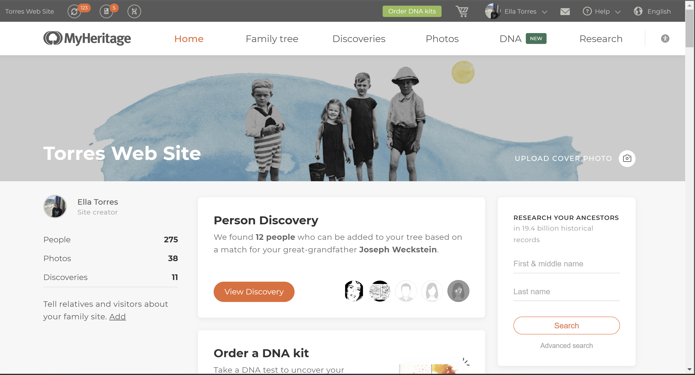
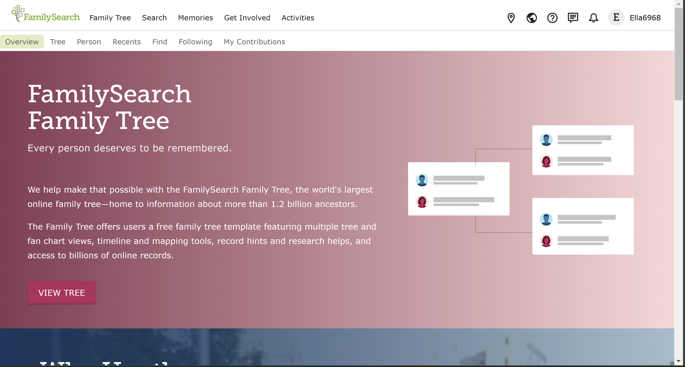

# DH110-Spring 2023
### Ella Torres
## Facilitating Family Connections Through Geneology Technology
#### Project Description: By performing an analysis of user experience design of family tree apps such as MyHeritage and FamilySearch, I aim to help make fostering family connections through family history even more straightforward and convenient.
### Assignment 1 : Heuristic Evaluation

## App 1: MyHeritage

View the full site here: [MyHeritage](https://www.myheritage.com)
#### Background Information
MyHeritage is a genealogy and family history platform that offers an app for mobile devices. The MyHeritage app is available for both iOS and Android devices and provides users with easy access to their family trees, as well as a variety of tools for researching and discovering their ancestors. Some of the key features of the MyHeritage app include family tree management, DNA testing, record matching, photo enhancements, and research tools. Overall, the MyHeritage app is a powerful tool for anyone interested in discovering their family history and building a comprehensive family tree.

#### Heuristic Evaluation
_Overall Evaluation_: Overall, in evaluating the MyHeritage app, I identified several strengths and limitations based on 10 usability heuristics. The strengths of the app include providing clear and consistent feedback to users, using familiar terminology, allowing user control and flexibility, following common design patterns, providing helpful error messages, using visual cues and labels, offering advanced features, providing detailed and relevant information, and offering comprehensive help and documentation. The limitations of the app include slow loading times for larger family trees or media files, inconsistent use of color and typography, a cluttered and overwhelming user interface, confusing navigation, limited customization options, some errors in data matching, and lack of integration with external genealogy sources.

| Heuristic & Description                                                                                                                                                     | Evaluation                                                                                                                                                                                                                                                                                                                                                                                                                                           | Recommendation for Limitations                                                                                                                                                    | Severity of "Bad" Element(s) |
| --------------------------------------------------------------------------------------------------------------------------------------------------------------------------- | ---------------------------------------------------------------------------------------------------------------------------------------------------------------------------------------------------------------------------------------------------------------------------------------------------------------------------------------------------------------------------------------------------------------------------------------------------- | ----------------------------------------------------------------------------------------------------------------------------------------------------------------------------------- | ------------------------- |
| **1\. Visibility of system status** The app should always keep users informed about what is happening, through appropriate feedback within a reasonable time.                                                                         | The app provides clear and consistent feedback to users, such as loading indicators, progress bars, and confirmation messages, helping users understand the current state of the system. In some cases, the loading times for larger family trees or media files can be slow, which may cause frustration for users. | Load less generations of the family tree to start with until prompted by the user to expand the tree.                                                                | 2                         |
| **2\. Match between system and the real world** The app should use language and concepts familiar to the user, making it easier for them to understand and navigate.  |The app uses familiar concepts and terminology to represent genealogy concepts, such as "family tree," "ancestor," and "descendant," making it easier for users to understand and use the app. Some users who are new to genealogy research may still find the terminology confusing or difficult to understand.                                                                                                                                                                                                                                                      | Provide a comprehensive guide on geneology terminology                                                                                      | 2                        |
| **3\. User control and freedom** The app should provide the user with clear and easy ways to undo or redo actions, and to escape from unwanted or unintended situations.                                                                             | The app allows users to undo and redo actions, as well as navigate back and forth through the app using the back button or the app's navigation menu, giving users a sense of control and flexibility. In some cases, users may accidentally delete or modify data in their family tree and not be able to recover it due to limitations in the app's undo and redo functionality.                                                                                                                                                                                                                                  | Create a history of actions performed on the users family tree.                                                                                     | 2                         |
| **4\. Consistency and standards** The app should follow established conventions, both in terms of design and behavior, to minimize the learning curve and confusion.                                                                               | The app follows common design patterns for mobile apps, such as using a tab bar at the bottom of the screen for navigation and a hamburger menu for additional options, making it easy for users to navigate and use the app. Some users may find the app's use of color and typography to be inconsistent, making it harder to differentiate between different types of information.               |  Color code different genres of imformation relating to family members                                             | 1                         |
| **5\. Error prevention** The app should have design features and mechanisms in place to prevent users from making errors, such as confirmation dialogs or limiting choices.                                          | The app provides helpful error messages that explain what went wrong and how to fix it, such as when a user tries to add a person to the family tree without providing enough information, reducing user frustration. It clearly flags inconsistencies with relations and dates such as someone being to old to be marked alive                                                                                                                                                                                                                                             | No suggestions                                                            | 1                       |
| **6\. Recognition rather than recall** The app should make use of visible options and prompts, rather than relying on the user to remember information or recall past interactions.                                             |The app provides visual cues and labels to help users understand the purpose and function of each element, rather than requiring them to remember or recall them, making it easier for users to navigate and use the app. Some users may still find the app's user interface to be overwhelming or cluttered, making it difficult to find the information they need especially in the record match sections.                                                                                                                                                                    | Do not overwhelm the user with all possible results at once and filter out matches they already have all the information from.                                                                                                          | 2                         |
| **7\. Flexibility and efficiency of use**  The app should offer ways for both novice and expert users to accomplish tasks, such as through customizable shortcuts or expert-level options                                                     |The app offers shortcuts and advanced features, such as keyboard shortcuts for editing text fields and the ability to import a family tree from another source, increasing user efficiency. Some users may find the advanced features of the app to be too complex or difficult to use, leading to frustration such as filtering down results in the research section.                                                                                                                                                                                | Start with exact results in research instead of having it as an advanced feature option              | 2                         |
| **8\. Aesthetic and minimalist design** The app should present information and functionality in a clear, visually appealing and uncluttered way.                                  | The app uses a clean and minimalist design, with a focus on the family tree view and the user's content, rather than distracting graphics or animations, making it easy for users to focus on the information they need. Some users may find the app's design to be too simple or bland, leading to a lack of engagement.                                                                                                                          |No Suggestions     | 1                         |
| **9\. Help users recognize, diagnose, and recover from errors** The app should provide users with helpful and clear error messages, and offer solutions and guidance to recover from errors or mistakes.                     | The app provides helpful error messages and instructions on how to recover from errors, such as when a user tries to upload an unsupported file format, helping users troubleshoot issues or if the user uploads any information with inconsistencies to records on file.                                                                                                                                                                                       | No suggestions                                                | 1                        |
| **10\. Help and documentation** The app should provide clear and comprehensive help documentation, with contextual help and links to additional resources, to assist users in using the app effectively.                                                                    | The app offers a comprehensive help center with FAQs, tutorials, and support articles, as well as a customer support team that users can contact for assistance                                                                                                                                                                | No suggestions| 1                         |
## App 2: FamilySearch

View the full site here: [FamilySearch](https://www.familysearch.org)
#### Background Information
FamilySearch is a genealogy and family history platform that offers an app for mobile devices. The FamilySearch app is available for both iOS and Android devices and provides users with a range of tools and resources for researching and discovering their ancestors.
Some of the key features of the FamilySearch app include  family tree management, record searching, collaboration with others, memories or person document preservation, and research assistance. Overall, the FamilySearch app is a powerful tool for anyone interested in discovering their family history and building a comprehensive family tree. The app is free to use and offers a wealth of resources and tools to help users uncover their family's past.

#### Heuristic Evaluation
_Overall Evaluation_: Overall, the FamilySearch app has several strengths and limitations based on 10 usability heuristics. The strengths of the app include providing clear and consistent feedback to users, using familiar terminology, allowing user control and flexibility, following common design patterns, providing helpful error messages, using visual cues and labels, offering advanced features, using a minimalist design, providing guidance on recovering from errors, and offering comprehensive help and documentation. The limitations of the app include slow loading times for larger family trees or media files, terminology that may be confusing for new users, limitations in undo/redo functionality, inconsistent use of color and typography, error messages that may be too technical for some users, an overwhelming or cluttered user interface, advanced features that may be too complex for some users, a design that may be too simple or bland for some users, and error messages that may not provide enough information or guidance to help users resolve issues.

| Heuristic & Description                                                                                                                                                     | Evaluation                                                                                                                                                                                                                                                                                                                                                                                                                                           | Recommendation for Limitations                                                                                                                                                    | Severity of "Bad" Element(s) |
| --------------------------------------------------------------------------------------------------------------------------------------------------------------------------- | ---------------------------------------------------------------------------------------------------------------------------------------------------------------------------------------------------------------------------------------------------------------------------------------------------------------------------------------------------------------------------------------------------------------------------------------------------- | ----------------------------------------------------------------------------------------------------------------------------------------------------------------------------------- | ------------------------- |
| **1\. Visibility of system status** The app should always keep users informed about what is happening, through appropriate feedback within a reasonable time.                                                                         | The app provides clear and consistent feedback to users, such as loading indicators, progress bars, and confirmation messages, helping users understand the current state of the system. The pending tasks section however is limited by not having clear sections on types of tasks. | Make subgenres of tasks in the task feature.                                                                | 2                         |
| **2\. Match between system and the real world** The app should use language and concepts familiar to the user, making it easier for them to understand and navigate.  |The app uses familiar concepts and terminology to represent genealogy concepts, such as "family tree," "ancestor," and "descendant," making it easier for users to understand and use the app. Some users who are new to genealogy research may still find the terminology confusing or difficult to understand.                                                                                                                                                                                                                                                      | Provide a comprehensive guide on geneology terminology                                                                                      | 2                        |
| **3\. User control and freedom** The app should provide the user with clear and easy ways to undo or redo actions, and to escape from unwanted or unintended situations.                                                                             | The app allows users to undo and redo actions, as well as navigate back and forth through the app using the back button or the app's navigation menu, giving users a sense of control and flexibility. In some cases, users may accidentally delete or modify data in their family tree and not be able to recover it due to limitations in the app's undo and redo functionality.                                                                                                                                                                                                                                  | Create a history of actions performed on the users family tree.                                                                                     | 2                         |
| **4\. Consistency and standards** The app should follow established conventions, both in terms of design and behavior, to minimize the learning curve and confusion.                                                                               | The app follows common design patterns for mobile apps, such as using a tab bar at the bottom of the screen for navigation and a hamburger menu for additional options, making it easy for users to navigate and use the app. Some users may find the app's use of color and typography to be inconsistent, making it harder to differentiate between different types of information.               |  Color code different genres of imformation relating to family members                                             | 1                         |
| **5\. Error prevention** The app should have design features and mechanisms in place to prevent users from making errors, such as confirmation dialogs or limiting choices.                                          | The app provides helpful error messages that explain what went wrong and how to fix it, such as when a user tries to add a person to the family tree without providing enough information, reducing user frustration. It clearly flags inconsistencies with relations and dates such as someone being to old to be marked alive                                                                                                                                                                                                                                             | No suggestions                                                            | 1                       |
| **6\. Recognition rather than recall** The app should make use of visible options and prompts, rather than relying on the user to remember information or recall past interactions.                                             |The app provides visual cues and labels to help users understand the purpose and function of each element, rather than requiring them to remember or recall them, making it easier for users to navigate and use the app. Some users may still find the app's user interface to be overwhelming or cluttered, making it difficult to find the information they need especially in the record match sections.                                                                                                                                                                    | Do not overwhelm the user with all possible results at once and filter out matches they already have all the information from.                                                                                                          | 2                         |
| **7\. Flexibility and efficiency of use**  The app should offer ways for both novice and expert users to accomplish tasks, such as through customizable shortcuts or expert-level options                                                     |The app offers shortcuts and advanced features, such as keyboard shortcuts for editing text fields and the ability to import a family tree from another source, increasing user efficiency. Some users may find the advanced features of the app to be too complex or difficult to use, leading to frustration such as filtering down results in the research section.                                                                                                                                                                                | Start with exact results in research instead of having it as an advanced feature option              | 2                         |
| **8\. Aesthetic and minimalist design** The app should present information and functionality in a clear, visually appealing and uncluttered way.                                  | The app uses a clean and minimalist design, with a focus on the family tree view and the user's content, rather than distracting graphics or animations, making it easy for users to focus on the information they need. Some users may find the app's design to be too simple or bland, leading to a lack of engagement.                                                                                                                          |No Suggestions     | 1                         |
| **9\. Help users recognize, diagnose, and recover from errors** The app should provide users with helpful and clear error messages, and offer solutions and guidance to recover from errors or mistakes.                     | The app provides helpful error messages and instructions on how to recover from errors, such as when a user tries to upload an unsupported file format, helping users troubleshoot issues or if the user uploads any information with inconsistencies to records on file.                                                                                                                                                                                       | No suggestions                                                | 1                        |
| **10\. Help and documentation** The app should provide clear and comprehensive help documentation, with contextual help and links to additional resources, to assist users in using the app effectively.                                                                    | The app offers a comprehensive help center with FAQs, tutorials, and support articles, as well as a customer support team that users can contact for assistance                                                                                                                                                                | No suggestions| 1                         |
