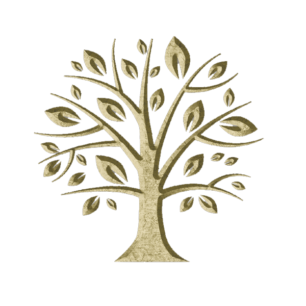

# Facilitating Family Connections Through Genealogy Technology
### *Ella Torres Digital Humanities 110, Spring 2023*

### Introduction: About the Project

The project revolves around enhancing the user experience of genealogy technologies, with a strong emphasis on strengthening family connections. The motivation behind this endeavor stems from the recognition of the profound importance of family bonds and the desire to make the process of exploring one's ancestry more engaging and accessible. By developing a genealogy app that prioritizes user journey, our project aims to create a seamless and intuitive experience for individuals to delve into their family history. Through this app, users will be able to easily navigate their ancestral lineage, connect with relatives, and discover their unique heritage. The project's contribution lies in revolutionizing the way people engage with their family history, fostering a greater sense of identity and connection among individuals and their ancestors.

### Design Statement: 

The issue at hand is the need to improve the user experience of genealogy technologies, particularly in terms of strengthening family connections. It is crucial to address this issue through our project because family bonds hold significant value in people's lives, and exploring one's ancestry can provide a deeper understanding of oneself and a sense of belonging. By prioritizing user experience and creating a genealogy app that facilitates a seamless and intuitive journey, we aim to make the process of delving into family history more engaging and accessible. Our project seeks to empower individuals to connect with their relatives, navigate their ancestral lineage, and discover their unique heritage, thus fostering a stronger sense of identity and connection with their roots.

### Competitor analysis:
#### Heuristic evaluation

The project's initial phase involved conducting heuristic evaluations on websites related to the project's subject matter. The purpose of these evaluations was to gain insights into the strengths and limitations of the platforms. Two platforms, MyHeritage and FamilySearch, were assessed using 10 established usability heuristics. Components such as feedback to users, terminology usage, user control and flexibility, design patterns, error messages, visual cues, advanced features, information provision, and help documentation were examined. 

The evaluations revealed that the MyHeritage app demonstrated strengths in providing clear and consistent feedback, using familiar terminology, allowing user control, following design patterns, delivering helpful error messages, employing visual cues and labels, offering advanced features, providing detailed information, and offering comprehensive help and documentation. However, limitations were also identified, including slow loading times for larger family trees or media files, inconsistent use of color and typography, a cluttered interface, confusing navigation, limited customization options, errors in data matching, and a lack of integration with external genealogy sources. Similarly, the evaluation of the FamilySearch app showcased strengths such as clear and consistent feedback, familiar terminology, user control, design pattern adherence, helpful error messages, visual cues and labels, advanced features, minimalist design, guidance on error recovery, and comprehensive help and documentation. However, limitations were observed, including slow loading times for larger family trees or media files, potentially confusing terminology for new users, limitations in undo/redo functionality, inconsistent use of color and typography, technical error messages, an overwhelming or cluttered interface, complex advanced features, a perceived simplistic design, and error messages lacking sufficient guidance.

These heuristic evaluations provided valuable insights into the strengths and limitations of the evaluated platforms, serving as a foundation for the design and development of the project's own app. The project aims to address the identified limitations while leveraging the strengths of the evaluated platforms to ensure a user-centered and refined final product.

##### Find the full evaluation [here](https://github.com/ellatorres08/DH110-familyconnection/tree/main/assignment1)

#### Usability Testing

UT, which stands for User Testing, is a method used to evaluate a product or service by directly observing and gathering feedback from users. Its purpose is to identify usability issues and design flaws to improve the app from a user's perspective. In this particular UT, a pilot test is conducted to test the app's setting and materials, including the app itself and a test survey with tasks. The test takes place in the participant's home using a portable minimalistic lab, typically consisting of a laptop or smartphone and a video calling app with screen sharing capabilities. The process involves defining the objectives and goals of the test, aligning them with the findings of the heuristic evaluation conducted in assignment 1. The heuristic evaluation identified potential problems in various aspects, such as system status visibility, match between the app and the real world, user control and freedom, error prevention, recognition rather than recall, flexibility and efficiency of use, and aesthetic and minimalist design. The UT process includes the participant following a questionnaire that assesses their experience with the app, initial impressions, completion of tasks, and overall sentiments. Reflection on the UT revealed areas of confusion and user-friendliness in the app's organization, with issues related to locating information, search functions, advanced features, and error prevention. Suggestions for future UT improvements include better participant preparation with more family history information and involving two family members as participants to assess usability and connection facilitation.

##### Find the full usability testing [here](https://github.com/ellatorres08/DH110-familyconnection/tree/main/assignment2)

### User research

After conducting UT, I decide to expand 
I thoroughly enjoyed the contextual inquiry process. I feel that the reflection questions paired along with the activities allowed the user to be very candid about each feature of the app and accurately contemplate its impact on the family tree building experience. Observing my interviewee’s reactions and prompting them to think about family connection through genealogy greatly helped reveal many of the positive aspects and limitations of the FamilySearch app. Since this project focuses on technology that facilitates family connection, the interview helped enlighten me on which features of the app really promote working together with your family members. The user even expressed excitement on sharing information and completing the offered family history activities with their relatives. On the other hand, my interviewee expressed some disappointment in other sections, such as the limitations when searching for records from family members with common names or ones that don’t come from the United States. Additionally, the information provided about their culture after building the family tree and adding location detail, was noted as very shallow. I can see how this technology could benefit someone outside of their culture and with little knowledge of their family history. However, the knowledge provided seemingly only scratches the surface for what my user hoped to find about their ancestors, their history and their country. In the future, my user research may be aided by interviewing a user with more family history in countries that the apps database has a larger volume of records in, as well as someone with ancestors who come from various backgrounds and countries, in order to diversify results and generated cultural information.

##### Find the full user research assignment [here](https://github.com/ellatorres08/DH110-familyconnection/tree/main/assignment3)

### UX storytelling 

UX storytelling emphasizes the importance of a user-centered experience by considering the underlying feelings and desires of users. It moves away from relying solely on heuristic principles and competitor analysis. By creating personas, such as Saige, a first-generation web developer, and Evelyn, a retired grandma, researchers gain insight into how the current system fails to meet their goals. Saige utilizes the app to strengthen family connections and learn more about their Haitian heritage, participating in family history activities and communicating with relatives overseas. Meanwhile, Evelyn uses the app to record her family history for future generations, connect with her grandchildren, and spend quality time with her family through various interactive activities. These personas highlight the specific needs and motivations of users, ensuring that the project caters to their experiences and desires.

##### Find the full UX storytelling assignment [here](https://github.com/ellatorres08/DH110-familyconnection/tree/main/assignment4)

### Wireframe and graphic design element variation 

In order to develop a genealogy app that prioritizes a seamless and intuitive user journey, we utilize an interface design system to explore various app appearances and assess their impact on users. By evaluating different elements like shapes, layouts, colors, and typography, we aim to create an interface that resonates with users and meets their needs. Through the use of digitized wireframes, we analyze the family tree feature to identify the most effective visual and functional elements. This process allows us to refine the app's appearance, enhancing usability and enabling users to connect more effectively with their family history and heritage. User feedback indicates that the wireframe section was inviting and user-friendly, with a balance of professionalism and warmth. The inclusion of rounder shapes and the avoidance of childish fonts was particularly appreciated, as it maintained a family-friendly atmosphere without sacrificing professionalism. The standard rectangles were seen as uncomfortable and rigid, prompting their exclusion from the design options.

##### Find the full wireframe assignment [here](https://github.com/ellatorres08/DH110-familyconnection/tree/main/assignment6)

### Low-fidelity prototype 

This low fidelity paper prototype serves as a valuable tool for early-stage design exploration, collaboration, and gathering feedback to address usability concerns and guide decision-making. It allows for efficient iteration on design concepts and ensures a cost-effective and user-centered development process. During user testing, it was observed that adding a back button to the search feature would enhance the user experience by enabling quicker navigation between connecting pages. Additionally, renaming the "family records" section to "personal records" and including a dropdown menu with all available options would alleviate confusion and provide a clearer overview of the app's features. These insights gained from testing will inform design improvements for a more effective and user-friendly final product.

##### Find the full low-fidelity prototype assignment [here](https://github.com/ellatorres08/DH110-familyconnection/tree/main/assignment5)

### High-fidelity prototype 

A high fidelity prototype for the familytree app serves as a realistic and interactive representation of the final product, enabling designers, stakeholders, and users to experience its look, feel, and functionality in a tangible way. By validating design choices, collecting feedback, and identifying usability issues early on, the high fidelity prototype ensures a more refined and user-centered end product. In the process of creating this high fidelity prototype using Figma, components from the graphic design element variation are applied in order to lay out screens with consistent visual elements, and then interactions are added for a realistic user experience. Interactive elements are linked to different screens or actions, allowing users to navigate and interact with the prototype. Feedback from stakeholders and users gathered through sharing the prototype helps in refining the design before moving to development.

##### Find the full high fidelity prototype assignment [here](https://github.com/ellatorres08/DH110-familyconnection/tree/main/assignment7)

##### Interact with the high fidelity prototype [here](https://www.figma.com/proto/foHAtFw2yVjXmyHeFCiJ6X/Week-5?type=design&node-id=38-2766&scaling=min-zoom&page-id=5%3A2&starting-point-node-id=38%3A2766)

### Pitch video 

### Conclusion

Throughout this project, I gained valuable insights and knowledge about user experience (UX) and interface design. The opportunity to work with Figma allowed me to develop new skills and proficiency in creating visually appealing and functional prototypes. From low fidelity wireframes to high fidelity prototypes, I learned how to effectively translate design concepts into tangible representations of the final product. The process of user testing and evaluation taught me the importance of gathering feedback and incorporating user perspectives to improve the overall usability and user-centered design of the app.

One of the most exciting aspects of this project was the opportunity to engage in UX storytelling. Through this process, I was able to explore the potential capabilities of the app and think creatively about how it could provide a seamless and enjoyable user experience. By envisioning user journeys and scenarios, I expanded my mind and uncovered new possibilities for enhancing the app's features and functionalities. UX storytelling enabled me to bridge the gap between design and user needs, ensuring that the app not only looks visually appealing but also serves its purpose effectively.

Overall, this project has been a valuable learning experience for me. I have deepened my understanding of UX principles, interface design, and the importance of user testing and evaluation in the design process. By developing both low and high fidelity prototypes and engaging in UX storytelling, I have not only honed my design skills but also broadened my perspective on what is achievable in creating a user-centered and engaging app. I look forward to applying these newfound skills and knowledge in future design endeavors, continuously striving to create exceptional user experiences.
