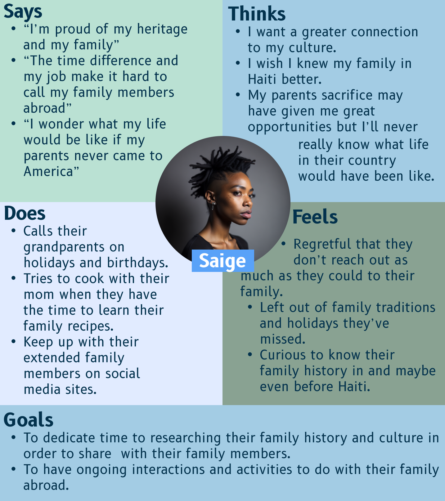

# DH110-Spring 2023
### Ella Torres
## Facilitating Family Connections Through Genealogy Technology
#### Project Description: This project aims to enhance the user experience design of family tree apps like MyHeritage and FamilySearch to facilitate easy and convenient connections between family members through family history. Through an analysis of these apps, the project seeks to identify areas where improvements can be made to streamline the process of building and maintaining family trees, ultimately promoting stronger family bonds.
## Assignment 1 : Heuristic Evaluation

### App 1: MyHeritage

View the full site here: [MyHeritage](https://www.myheritage.com)
#### Background Information
MyHeritage is a genealogy and family history platform that offers an app for mobile devices. The MyHeritage app is available for both iOS and Android devices and provides users with easy access to their family trees, as well as a variety of tools for researching and discovering their ancestors. Some of the key features of the MyHeritage app include family tree management, DNA testing, record matching, photo enhancements, and research tools. Overall, the MyHeritage app is a powerful tool for anyone interested in discovering their family history and building a comprehensive family tree.

#### Heuristic Evaluation
_Overall Evaluation_: Overall, in evaluating the MyHeritage app, I identified several strengths and limitations based on 10 usability heuristics. The strengths of the app include providing clear and consistent feedback to users, using familiar terminology, allowing user control and flexibility, following common design patterns, providing helpful error messages, using visual cues and labels, offering advanced features, providing detailed and relevant information, and offering comprehensive help and documentation. The limitations of the app include slow loading times for larger family trees or media files, inconsistent use of color and typography, a cluttered and overwhelming user interface, confusing navigation, limited customization options, some errors in data matching, and lack of integration with external genealogy sources.

| Heuristic & Description                                                                                                                                                     | Evaluation                                                                                                                                                                                                                                                                                                                                                                                                                                           | Recommendation for Limitations                                                                                                                                                    | Severity of "Bad" Element(s) |
| --------------------------------------------------------------------------------------------------------------------------------------------------------------------------- | ---------------------------------------------------------------------------------------------------------------------------------------------------------------------------------------------------------------------------------------------------------------------------------------------------------------------------------------------------------------------------------------------------------------------------------------------------- | ----------------------------------------------------------------------------------------------------------------------------------------------------------------------------------- | ------------------------- |
| **1\. Visibility of system status** The app should always keep users informed about what is happening, through appropriate feedback within a reasonable time.                                                                         | The application offers users clear and uniform responses, such as progress bars, loading indicators, and confirmation messages, to aid them in comprehending the system's present status. However, some users may experience frustration due to prolonged loading times when dealing with larger family trees or media files. | Load less generations of the family tree to start with until prompted by the user to expand the tree.                                                                | 2                         |
| **2\. Match between system and the real world** The app should use language and concepts familiar to the user, making it easier for them to understand and navigate.  |The app uses familiar concepts and terminology to represent genealogy concepts, such as "family tree," "ancestor," and "descendant," making it easier for users to understand and use the app. Some users who are new to genealogy research may still find the terminology confusing or difficult to understand.                                                                                                                                                                                                                                                      | Provide a comprehensive guide on geneology terminology                                                                                      | 2                        |
| **3\. User control and freedom** The app should provide the user with clear and easy ways to undo or redo actions, and to escape from unwanted or unintended situations.                                                                             | The app allows users to undo and redo actions, as well as navigate back and forth through the app using the back button or the app's navigation menu, giving users a sense of control and flexibility. In some cases, users may accidentally delete or modify data in their family tree and not be able to recover it due to limitations in the app's undo and redo functionality.                                                                                                                                                                                                                                  | Create a history of actions performed on the users family tree.                                                                                     | 2                         |
| **4\. Consistency and standards** The app should follow established conventions, both in terms of design and behavior, to minimize the learning curve and confusion.                                                                               | The app follows common design patterns for mobile apps, such as using a tab bar at the bottom of the screen for navigation and a hamburger menu for additional options, making it easy for users to navigate and use the app. Some users may find the app's use of color and typography to be inconsistent, making it harder to differentiate between different types of information.               |  Color code different genres of imformation relating to family members                                             | 1                         |
| **5\. Error prevention** The app should have design features and mechanisms in place to prevent users from making errors, such as confirmation dialogs or limiting choices.                                          | The app provides helpful error messages that explain what went wrong and how to fix it, such as when a user tries to add a person to the family tree without providing enough information, reducing user frustration. It clearly flags inconsistencies with relations and dates such as someone being to old to be marked alive                                                                                                                                                                                                                                             | No suggestions                                                            | 1                       |
| **6\. Recognition rather than recall** The app should make use of visible options and prompts, rather than relying on the user to remember information or recall past interactions.                                             |The app provides visual cues and labels to help users understand the purpose and function of each element, rather than requiring them to remember or recall them, making it easier for users to navigate and use the app. Some users may still find the app's user interface to be overwhelming or cluttered, making it difficult to find the information they need especially in the record match sections.                                                                                                                                                                    | Do not overwhelm the user with all possible results at once and filter out matches they already have all the information from.                                                                                                          | 2                         |
| **7\. Flexibility and efficiency of use**  The app should offer ways for both novice and expert users to accomplish tasks, such as through customizable shortcuts or expert-level options                                                     |The app offers shortcuts and advanced features, such as keyboard shortcuts for editing text fields and the ability to import a family tree from another source, increasing user efficiency. Some users may find the advanced features of the app to be too complex or difficult to use, leading to frustration such as filtering down results in the research section.                                                                                                                                                                                | Start with exact results in research instead of having it as an advanced feature option              | 2                         |
| **8\. Aesthetic and minimalist design** The app should present information and functionality in a clear, visually appealing and uncluttered way.                                  | The app uses a clean and minimalist design, with a focus on the family tree view and the user's content, rather than distracting graphics or animations, making it easy for users to focus on the information they need. Some users may find the app's design to be too simple or bland, leading to a lack of engagement.                                                                                                                          |No Suggestions     | 1                         |
| **9\. Help users recognize, diagnose, and recover from errors** The app should provide users with helpful and clear error messages, and offer solutions and guidance to recover from errors or mistakes.                     | The app provides helpful error messages and instructions on how to recover from errors, such as when a user tries to upload an unsupported file format, helping users troubleshoot issues or if the user uploads any information with inconsistencies to records on file.                                                                                                                                                                                       | No suggestions                                                | 1                        |
| **10\. Help and documentation** The app should provide clear and comprehensive help documentation, with contextual help and links to additional resources, to assist users in using the app effectively.                                                                    | The app offers a comprehensive help center with FAQs, tutorials, and support articles, as well as a customer support team that users can contact for assistance                                                                                                                                                                | No suggestions| 1                         |
### App 2: FamilySearch

View the full site here: [FamilySearch](https://www.familysearch.org)
#### Background Information
FamilySearch is a genealogy and family history platform that offers an app for mobile devices. The FamilySearch app is available for both iOS and Android devices and provides users with a range of tools and resources for researching and discovering their ancestors.
Some of the key features of the FamilySearch app include  family tree management, record searching, collaboration with others, memories or person document preservation, and research assistance. Overall, the FamilySearch app is a powerful tool for anyone interested in discovering their family history and building a comprehensive family tree. The app is free to use and offers a wealth of resources and tools to help users uncover their family's past.

#### Heuristic Evaluation
_Overall Evaluation_: Overall, the FamilySearch app has several strengths and limitations based on 10 usability heuristics. The strengths of the app include providing clear and consistent feedback to users, using familiar terminology, allowing user control and flexibility, following common design patterns, providing helpful error messages, using visual cues and labels, offering advanced features, using a minimalist design, providing guidance on recovering from errors, and offering comprehensive help and documentation. The limitations of the app include slow loading times for larger family trees or media files, terminology that may be confusing for new users, limitations in undo/redo functionality, inconsistent use of color and typography, error messages that may be too technical for some users, an overwhelming or cluttered user interface, advanced features that may be too complex for some users, a design that may be too simple or bland for some users, and error messages that may not provide enough information or guidance to help users resolve issues.

| Heuristic & Description                                                                                                                                                     | Evaluation                                                                                                                                                                                                                                                                                                                                                                                                                                           | Recommendation for Limitations                                                                                                                                                    | Severity of "Bad" Element(s) |
| --------------------------------------------------------------------------------------------------------------------------------------------------------------------------- | ---------------------------------------------------------------------------------------------------------------------------------------------------------------------------------------------------------------------------------------------------------------------------------------------------------------------------------------------------------------------------------------------------------------------------------------------------- | ----------------------------------------------------------------------------------------------------------------------------------------------------------------------------------- | ------------------------- |
| **1\. Visibility of system status** The app should always keep users informed about what is happening, through appropriate feedback within a reasonable time.                                                                         | The app provides clear and consistent feedback to users, such as loading indicators, progress bars, and confirmation messages, helping users understand the current state of the system. The pending tasks section however is limited by not having clear sections on types of tasks. | Make subgenres of tasks in the task feature.                                                                | 2                         |
| **2\. Match between system and the real world** The app should use language and concepts familiar to the user, making it easier for them to understand and navigate.  |The app uses words that people are already familiar with, like "family tree," "ancestor," and "descendant," to explain genealogy. This makes it easier for most people to use the app, but some people who are new to genealogy might still have trouble understanding the words used.                                                                                                                                                                                                                                                      | Provide a comprehensive guide on geneology terminology                                                                                      | 2                        |
| **3\. User control and freedom** The app should provide the user with clear and easy ways to undo or redo actions, and to escape from unwanted or unintended situations.                                                                             | The app allows users to undo and redo actions, as well as navigate back and forth through the app using the back button or the app's navigation menu, giving users a sense of control and flexibility. In some cases, users may accidentally delete or modify data in their family tree and not be able to recover it due to limitations in the app's undo and redo functionality.                                                                                                                                                                                                                                  | Create a history of actions performed on the users family tree.                                                                                     | 2                         |
| **4\. Consistency and standards** The app should follow established conventions, both in terms of design and behavior, to minimize the learning curve and confusion.                                                                               | The mobile app adheres to standard design patterns, including utilizing a tab bar located at the bottom of the screen for navigation and a hamburger menu for accessing supplementary options. This design choice enhances user experience by simplifying navigation and usage of the app. However, certain users may encounter difficulties distinguishing between various types of information due to the app's inconsistent use of color and typography. Additionally, the absence of a homepage in the app places undue emphasis on the family tree feature and may inadvertently restrict users from exploring other functionalities.               |  Color code different genres of imformation relating to family members and add a homepage  with various options for tasks to perform.                                            | 1                         |
| **5\. Error prevention** The app should have design features and mechanisms in place to prevent users from making errors, such as confirmation dialogs or limiting choices.                                          | The app offers useful error messages to guide users on how to rectify errors, such as when a user attempts to add a family member to the tree with insufficient details, minimizing user annoyance. However, the app lacks error messages to alert users when their input contains inconsistent or contradictory information, which may be conflicting with other data in the family tree. This deficiency can potentially result in confusion for users who may not be able to identify the issue and fix it appropriately.                                                                                                                                                                                                                                             | Include error notifications for inconsistencies in the users' family tree information as well as offer a help guide to rectify specific errors.                                                            | 3                       |
| **6\. Recognition rather than recall** The app should make use of visible options and prompts, rather than relying on the user to remember information or recall past interactions.                                             |The app incorporates visual cues and labels to assist users in comprehending the role and functionality of each component, reducing the need to memorize or recollect them, hence simplifying navigation and usage of the app. However, the absence of visual recognition aids like icons or images makes it challenging for users to associate certain elements with their intended functions. This drawback can lead to a cluttered and complicated user interface that can be overwhelming to some users, making it harder for them to locate the desired information.Additionally, the app's color-coding scheme only distinguishes between the genders of family members, lacking a diverse range of colors to differentiate between generations or family connections. As a result, users may encounter difficulty identifying relationships between family members, particularly those from different generations, which can hinder the app's usefulness in tracking and documenting family history.                                                                                                                                                                    | Add more complex color coding to the family tree to help visualize connections and offer any pictures that can be found in research sections of the app to more easily identify relative/ ancestors.                                                                                                          | 3                         |
| **7\. Flexibility and efficiency of use**  The app should offer ways for both novice and expert users to accomplish tasks, such as through customizable shortcuts or expert-level options                                                     |The application provides users with time-saving shortcuts and advanced capabilities, including keyboard shortcuts for editing text fields and the option to import family trees from external sources, thereby improving their overall productivity. However, some users may experience difficulty in using these advanced features, leading to frustration, such as when attempting to filter search results in the research section. Moreover, the app includes several features for gathering family tree data, which may not be immediately apparent or easy to understand for some users..                                                                                                                                                                               | Provide apt describes for the purpose of each feature used to refine the users family tree.              | 2                         |
| **8\. Aesthetic and minimalist design** The app should present information and functionality in a clear, visually appealing and uncluttered way.                                  | The application prioritizes the family tree view and user-generated content over superfluous graphics and animations, utilizing a sleek and minimalist design that enables users to concentrate on the relevant information effortlessly. Nevertheless, the app's utilization of a dark background might pose visibility challenges for certain users, and its color-coding feature only distinguishes between male and female relatives, potentially making it too simplistic to discern between family branches.                                                                                                                          |Consider incorporating both light and dark modes for the app's color scheme. It may also be beneficial to implement a more nuanced color-coding system for the user's family tree, enabling users to discern between family branches with greater ease.    | 2                         |
| **9\. Help users recognize, diagnose, and recover from errors** The app should provide users with helpful and clear error messages, and offer solutions and guidance to recover from errors or mistakes.                     | The app provides helpful error messages and instructions on how to recover from errors, such as when a user tries to upload an unsupported file format, helping users troubleshoot issues or if the user uploads any information with inconsistencies to records on file.                                                                                                                                                                                       | No suggestions                                                | 1                        |
| **10\. Help and documentation** The app should provide clear and comprehensive help documentation, with contextual help and links to additional resources, to assist users in using the app effectively.                                                                    | The app offers a comprehensive help center with FAQs, tutorials, and support articles, as well as a customer support team that users can contact for assistance                                                                                                                                                                | No suggestions| 1                         |

## Assignment 2 : Pilot UT

#### Introduction

UT stands for User Testing, and it is a method of evaluating a product or service by directly observing and gathering feedback from its users. The purpose of UT is to identify any usability issues, design flaws, or other problems in order to improve the app from a user's perspective.
This particular UT is a pilot test in order to test the setting and materials (app and test survey with tasks). It takes place in the participant’s home via a portable minimalistic lab which usually consists of their laptop or smartphone device and a video calling app with screen share functionality (i.e. Zoom). To conduct a UT, the first step is to define the objectives and the goals of the test. These goals are aligned with the findings of the heuristic evaluation that can be found in assignment 1. The heuristic evaluation identified potential problems in the following heuristic sections:

-<i>Visibility of system status:</i> The pending tasks section is limited by not having clear sections on types of tasks.

-<i>Match between system and the real world:</i> people who are new to genealogy might still have trouble understanding the words used.

-<i>User control and freedom:</i> Users may accidentally delete or modify data in their family tree and not be able to recover it due to limitations in the app's undo and redo functionality.

-<i>Error prevention:</i> The app lacks error messages to alert users when their input contains inconsistent or contradictory information, which may be conflicting with other data in the family tree. This deficiency can potentially result in confusion for users who may not be able to identify the issue and fix it appropriately.

-<i>Recognition rather than recall:</i> The cluttered and complicated user interface that can be overwhelming to some users, making it harder for them to locate the desired information. Additionally, the app's color-coding scheme only distinguishes between the genders of family members, lacking a diverse range of colors to differentiate between generations or family connections. As a result, users may encounter difficulty identifying relationships between family members, particularly those from different generations, which can hinder the app's usefulness in tracking and documenting family history.
 
-<i>Flexibility and efficiency of use:</i> Some users may experience difficulty in using the advanced features, leading to frustration, such as when attempting to filter search results in the research section. Moreover, the app includes several features for gathering family tree data, which may not be immediately apparent or easy to understand for some users.

-<i>Aesthetic and minimalist design:</i>  Dark background might pose visibility challenges for certain users, and its color-coding feature only distinguishes between male and female relatives, potentially making it too simplistic to discern between family branches.

The process of UT involves the participant to follow along with the provided questionnaire which contains sections of background questions for previous experience with the app, pretest questions for the participants initial impressions of the app, three tasks with checklists to note if the participant could complete each part of each task, as well as post test questions to evaluate the participants sentiments towards each task and the app as a whole. By following along with the questionnaire, the participant helps measure the severity of the problems that the heuristic evaluation outlined and how we might be able to amend these issues. Specifically for this UT, the participant is able to outline what in the FamilySearch app was most confusing or difficult to use.

View the online survey here: [UT Survey](https://docs.google.com/forms/d/e/1FAIpQLSfalarqFEctNtBuHsywIdyrsgSO8AOFOrOSeUICsgc5XggjQA/viewform?usp=share_link)

View the UT Video here: [UT Recording](https://drive.google.com/file/d/16r8CGTZbmXOju9hRXsd1G9jQwc3heNGH/view?usp=share_link)

#### UT Reflection

Reflecting on this UT, I was able to learn many ways in which the organization of the app confused the participant and what about the app was very straightforward and user friendly. For example, my participant was able to add known information to their family tree with ease as there was a clear family tree section of the app that contained obvious addition signs along with color coding for paternal or maternal sides of each family branch. On the other hand, when it came to locating information that was not known off the top of their head for the family tree, it took much longer than expected for the participant to even find the function to search historical records. Once that was located, it was even more difficult for the participant to find associated records with their family. I was able to see that this was due to the issues in Recognition rather than recall, Flexibility and efficiency of use, as well as Error prevention. Firstly, the participant struggled to find the “search historical records” function as it was located in the “more” tab of the app which is quite cluttered and unclear as to which functions it contains for users. Then in searching for their relatives the participant struggled to identify and use the advanced features which would aid them in narrowing down the search results. Lastly, there was no sort of error notifications or prevention when the participant entered in wrong information into the family tree to better associate with record results. 

In the future, UT for this app may be improved by having the participant come better prepared with a bit more information on their family history. Given some time to find more accurate information on their grandparents may better measure the usability of the app's features. Additionally, since this particular project centers around facilitating family connection, it may prove worthwhile to conduct UT with two family members as participants that might help each other with the input of family information in order to measure usability issues in the future and evaluate how it might connect the two participants as they work together.

## Assignment 3 : User Research

### Introductory Steps

### :white_check_mark: Step 1: Specify the Project Design Challenge

**What is the main activity your project would support the users in accomplishing?**
>This project will support users in being able to facilitate a stronger family connection by looking deeper into their genealogy. Users will be able to construct their family trees and hopefully find relevant records and documents associated with their ancestors that could promote conversations with family members.

**What is the basic need involved for that activity?**
>This activity fulfills the user’s basic need for connection and understanding of one’s self and where they come from.

**What is/are the traditional/current solution(s) to satisfy the needs?**
>Current solutions to satisfy this need involve heavy research whether it be reaching out to family members that are currently alive for information or seeking out records online or in libraries. 

**What is/are the limitation(s) that possibly would be improved with (digital) technology?**
>Certain limitations that would be improved with genealogy technology are not knowing where to look for your family records or not being able to remember names from your family tree that might be found automatically on a genealogy site.

### :white_check_mark: Step 2: Identify Target Users

**What are the characteristics of users? (ex. demographics, preference, expertise)**

>Demographic: People with basic knowledge of their immediate family members information who are curious to learn more about their ancestors and where they come from.

>Preferences: users have the ability to identify basic information about their family members and navigate an application on a smartphone.

>Expertise: users do not need any particular level of expertise to use this application.

**Where would the users perform the activity?**
>Activities using the FamilySearch app can be performed anywhere, however users may want to have access to contacting family members to help gather initial information for their family tree when first starting out. After user input information is gathered, the user can add family members and search through historical records anywhere and anytime.

**What would the users do to complete that activity?**
>To add family members to their tree, users simply need to press on the addition symbol where that specific ancestor would be. For example, to add your maternal grandmother, you would press the addition symbol above your mothers box on the tree where her mother is indicated. To search records on your ancestors, users simply navigate to the search section and input any information gathered on that ancestor to narrow down related documents. The app can also automatically find information as you enter in new family members to your tree.

### :white_check_mark: Step 3: Pick Research Method(s)

* The research method I employed was **participatory observation**.

* I conducted **participatory observation research** with a friend who fits my target demographic details by performing several activities to further explore their family tree and history.

### Participatory Research Materials

**1. Contextual Inquiry Guide**

Please find my **script** for this interview [here](https://docs.google.com/document/d/11uJES14B16mDF33C-ZY2wpWcxDKgEvk9O8tRx1x_l74/edit?usp=sharing)

**2. User Data**

Please find the **recordings** of the interview [here](https://drive.google.com/drive/folders/1Ub4xKbsHrsR0_yWUqlKXsJ_zRbSdJykR?usp=share_link).

The **transcription** of the interview can be found [here](https://docs.google.com/document/d/15zprNvrbRN_br-SHwHDfwQ-Y_gXyyT9G4zBttaxFtSw/edit?usp=sharing).

### Here are some interesting quotes and insights from the interview:

**:one: The user reflects on the small amount of family records they could find. (Part 1 (18:11))**
> It (the lack of records) tells me that either there are not a lot of records that are saved, or this app doesn't have a large database. Again, they (User’s ancestors) all have pretty common names for the Dominican Republic. And I don't fully believe that the country keeps good records. of their things. So it's very possible that these records are just lost to time. Like that, there's maybe a copy somewhere else in like the possession of my grandparents.

**:two: The user's experience with the mapping feature of the familysearch app  (Part 2 (5:06))**
> I can see specifically where on the map the family that I have put in is located. Very cool. Well, I never knew that those two places were that far from each other where my mother is from and where my dad is from. It seems I can do this in generations.

**:three: The user notes their favorite part of activity three and the benefits/ shortcomings of the family history activities section of the FamilySearch app (Part 2 (15:02))**
> I think the where I'm from / the in home activities (Are their favorite features). Because I feel like the best way to learn about your heritage is always gonna be from the people who know it best who experienced it. And that's fun ways to share those things.
(Part 2 (17:25))
Like I think it (The family history activities section) was really cool. The culture tabs they had and the things on like society and stuff. But those were things I already knew. It's very surface level. It's like things you will experience in the culture. I guess it's good if you don't have like any exposure, I guess, to your culture. It could be a good start, but definitely not somewhere to finish looking.

**:four: The user reflects on the impact of their age on finding family history information (Part 2 (21:47))**
>That's such an interesting question. I don't think I think yes and no. Yes, it is a barrier because I don't know the information. I wasn't alive for it or I wasn't old enough for it to be in my circle of little kids stories. But no, in the sense that I can find things around the app very well that I can find the places to search for records and where these activities are fairly quickly. Because I am I've grown up with technology and I'm used to it by this point.

**:five: The user discusses their connection to the topic of family history (Part 2 (23:14))**
>I feel very connected to this topic. And I think it's a really interesting thing to research and look into However, having in an app, that tool like forming bases is to like, build your own little family tree and have all this information in one place. Although it seems nice it seems just kind of superficial. I feel like the best place you're always gonna get that kind of information is from source.

### Reflection

I thoroughly enjoyed the contextual inquiry process. I feel that the reflection questions paired along with the activities allowed the user to be very candid about each feature of the app and accurately contemplate its impact on the family tree building experience. Observing my interviewee’s reactions and prompting them to think about family connection through genealogy greatly helped reveal many of the positive aspects and limitations of the FamilySearch app. Since this project focuses on technology that facilitates family connection, the interview helped enlighten me on which features of the app really promote working together with your family members. The user even expressed excitement on sharing information and completing the offered family history activities with their relatives. On the other hand, my interviewee expressed some disappointment in other sections, such as the limitations when searching for records from family members with common names or ones that don’t come from the United States. Additionally, the information provided about their culture after building the family tree and adding location detail, was noted as very shallow. I can see how this technology could benefit someone outside of their culture and with little knowledge of their family history. However, the knowledge provided seemingly only scratches the surface for what my user hoped to find about their ancestors, their history and their country. In the future, my user research may be aided by interviewing a user with more family history in countries that the apps database has a larger volume of records in, as well as someone with ancestors who come from various backgrounds and countries, in order to diversify results and generated cultural information.

## Assignment 4 : Persona and Usage Scenario

### The Purpose of Storytelling

UX Storytelling serves as a reminder to researchers and designers that the user should be at the center of the experience. Rather than relying solely on heuristic principles and data points from user interviews, UX storytelling encourages researchers to delve deeper into the emotions and desires that drive user behavior, ensuring that these needs are met by the project's outcomes. By developing personas, researchers can think more broadly about the target users and gain a better understanding of how the existing system fails to meet their objectives.

### Persona & Empathy Map

#### Saige - The First Gen Web Developer  :
 

#### Saige's Empathy Map:

#### Evelyn - The Retired Grandma: 

#### Evelyn's Empathy Map:

### Scenarios & Journey Map

#### 1. Saige's Scenario

##### Why do they use the product?

Saige wishes to strengthen their connection with their family overseas and to their culture/ heritage. This app allows them to learn more about their ancestry, giving a method of communication and quality time with their relatives in Haiti. It also provides resources to learn more about Haitian culture in general.

##### How do they use the product?

Saige uses this product to create their family tree and participate in family history activities with their family members in different time zones. They work on different prompts to record history and learn more about their country with their relatives either at the same time via video call or on their own time, periodically checking in and seeing what their grandparents, aunts, uncles, and cousins have contributed.

#### 2. Evelyn's Scenario 
 
##### Why do they use the product?

 Evelyn hopes to record a family history for her children and grandchildren before she passes. The loneliness of losing her husband also made Evelyn realize she wanted a way to spend more quality time with her family. The app allows her to connect to her grandchildren, as they are more interested in technology, as well as share her story with involved activities.

##### How do they use the product

Evelyn uses the app to construct her family tree and record her stories of how her and her husband met and fell in love. She uploads her family records on the app and any information on her family's ancestors she knows as an archive for her children and future generations of her family. She also uses the app as a way to connect with her grandkids, using the many family history activities as a means for quality time together. 

