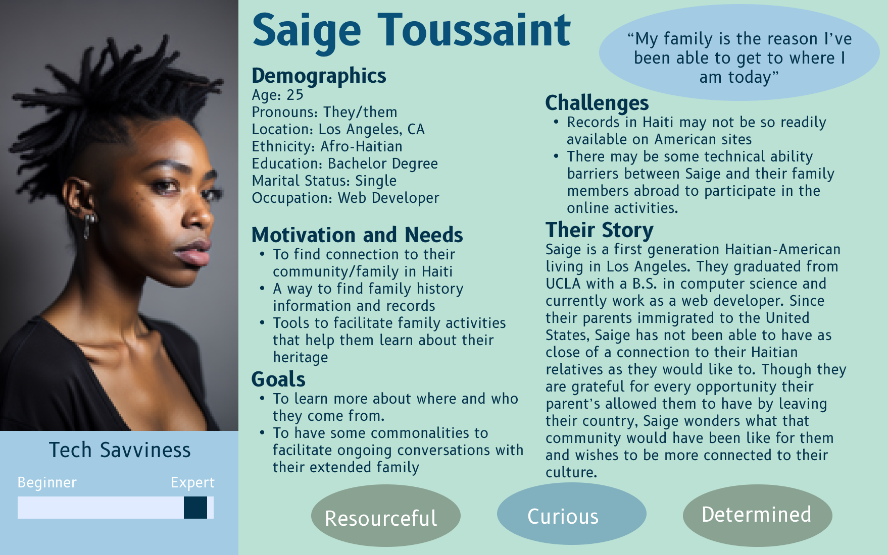
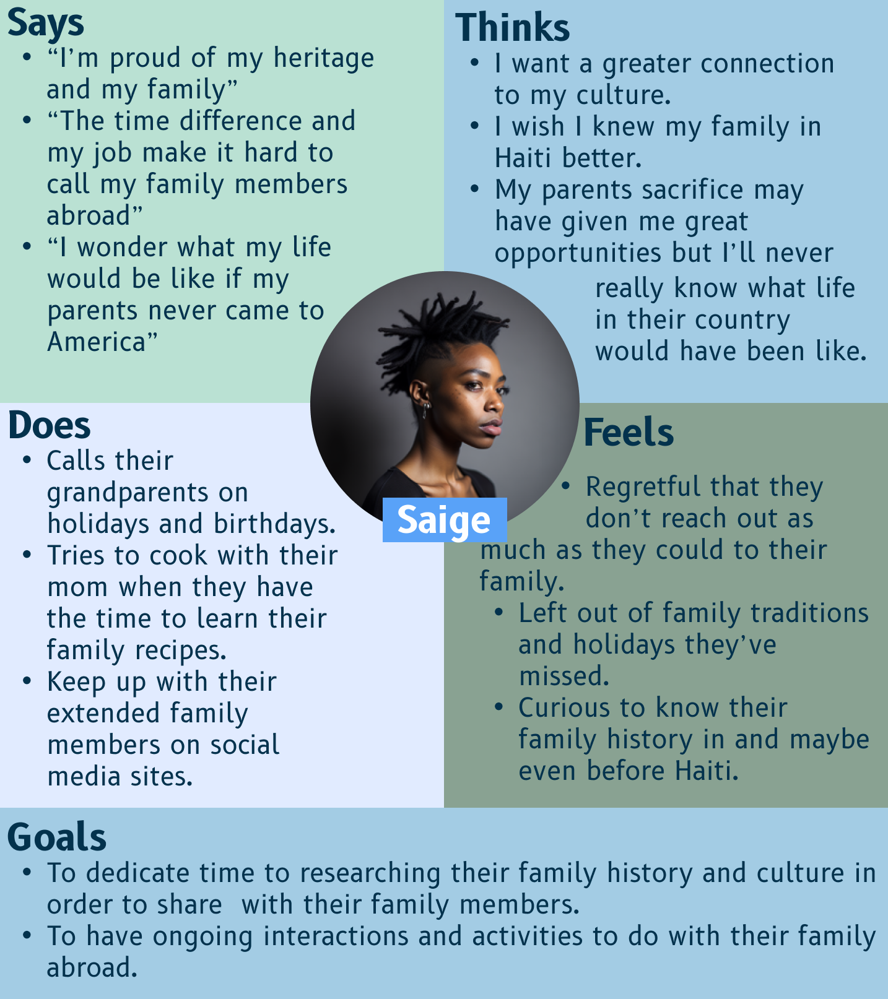
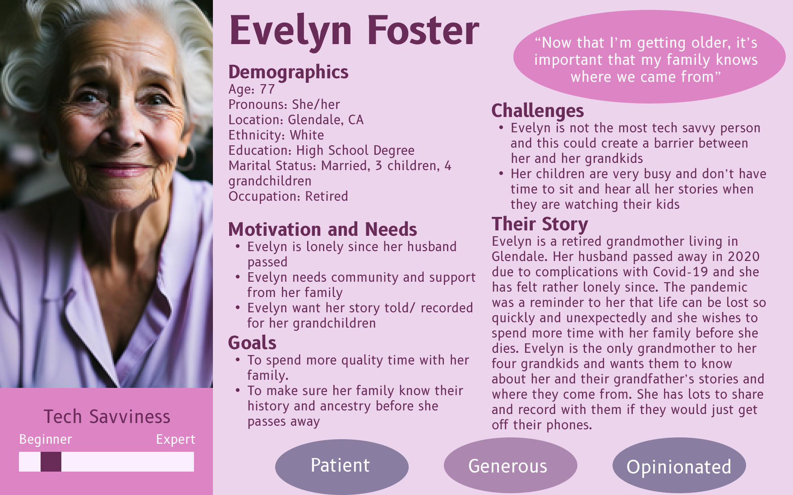
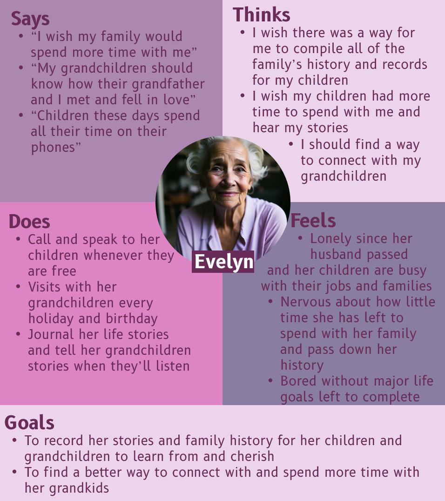
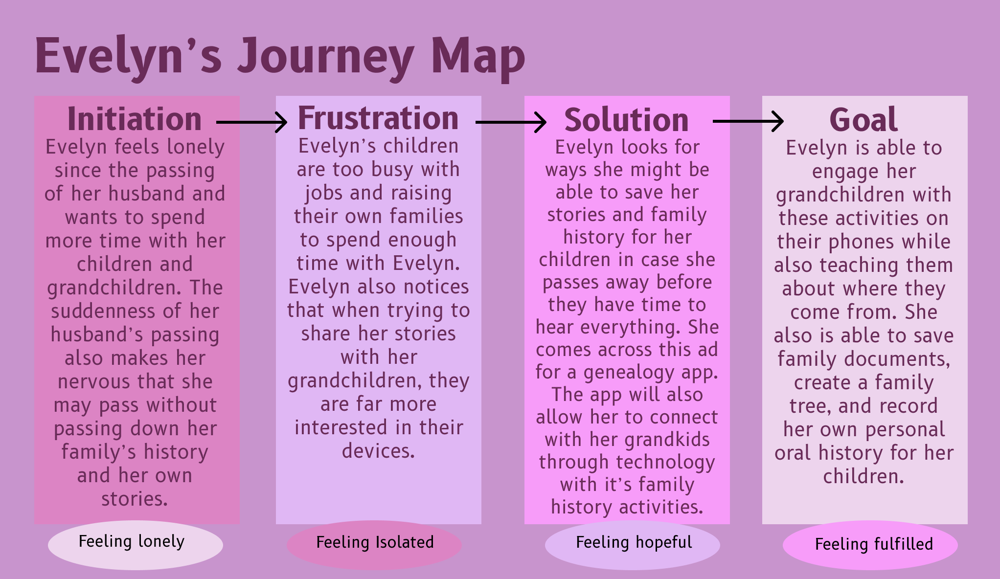

## Assignment 4 : Persona and Usage Scenario

### The Purpose of Storytelling

UX Storytelling serves as a reminder to researchers and designers that the user should be at the center of the experience. 
Rather than relying solely on heuristic principles and data points from user interviews, UX storytelling encourages researchers to 
delve deeper into the emotions and desires that drive user behavior, ensuring that these needs are met by the project's outcomes. By 
developing personas, researchers can think more broadly about the target users and gain a better understanding of how the existing 
system fails to meet their objectives.

### Persona & Empathy Map

#### Saige - The First Gen Web Developer  :
 

#### Saige's Empathy Map:

#### Evelyn - The Retired Grandma: 

#### Evelyn's Empathy Map:

### Scenarios & Journey Map

#### 1. Saige's Scenario

##### Why do they use the product?

Saige wishes to strengthen their connection with their family overseas and to their culture/ heritage. This app allows them to 
learn more about their ancestry, giving a method of communication and quality time with their relatives in Haiti. It also provides 
resources to learn more about Haitian culture in general.

##### How do they use the product?

Saige uses this product to create their family tree and participate in family history activities with their family members 
in different time zones. They work on different prompts to record history and learn more about their country with their relatives 
either at the same time via video call or on their own time, periodically checking in and seeing what their grandparents, aunts, 
uncles, and cousins have contributed.

#### 2. Evelyn's Scenario 
 
##### Why do they use the product?

Evelyn hopes to record a family history for her children and grandchildren before she passes. The loneliness of losing her husband 
also made Evelyn realize she wanted a way to spend more quality time with her family. The app allows her to connect to her grandchildren, 
as they are more interested in technology, as well as share her story with involved activities.

##### How do they use the product

Evelyn uses the app to construct her family tree and record her stories of how her and her husband met and fell in love.
She uploads her family records on the app and any information on her family's ancestors she knows as an archive for her children and 
future generations of her family. She also uses the app as a way to connect with her grandkids, using the many family history activities 
as a means for quality time together. 

