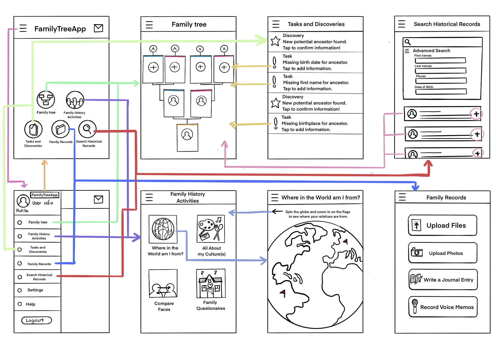
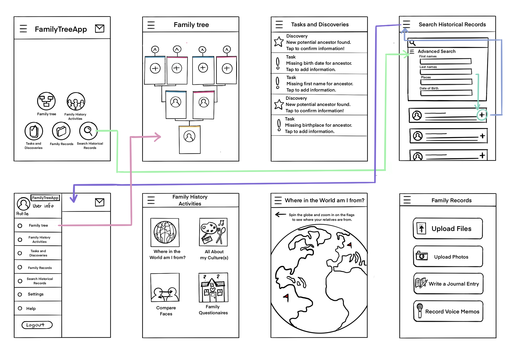
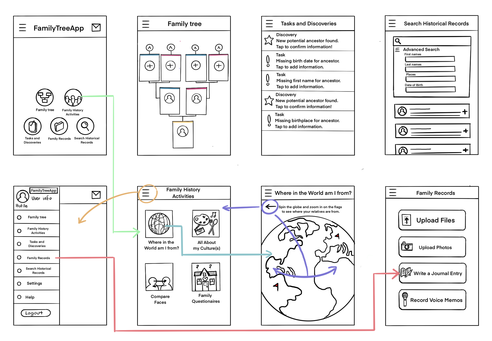

## Assignment 5 : Low-Fidelity Prototype

### Project Description:

This project aims to improve the users experience with genealogy technologies in order to best 
facilitate family connection for that user. The focus is on developing a genealogy app that optimizes 
the user journey. To achieve this, a low fidelity paper prototype is tested to conduct early-stage design 
exploration, encourage collaboration and feedback, address usability concerns, and guide decision-making before 
advancing to more resource-intensive stages of development. This approach allows us to efficiently iterate on design
concepts, gather valuable insights, and ensure a cost-effective and user-centered development process.
  
### Task List
The Low-Fidelity Prototype is able to support the following tasks:

1. Constructing a family tree
2. Family history activities to explore where and who you come from with your family (world mapping, culture information, 
3. face comparisons with your relatives and survey to fill out with your family to learn more about their own personal histories)
4. Tasks and discoveries page to confirm and complete family tree information
5. Searching historical records to find out more about your ancestors
6. Family records section that supports your own personal records uploads and creation (journal entries, file upload, photo upload, and voice memos

### Wireframes and Wireflows

### Prototype Testing

#### Task 1 : Search a family member's historical records and add them to your family tree.

For the first task, the user was able to find the search section and family tree section with relative ease. 
With every page labeled and homepage buttons as well as menu drop downs for each section, they found the path clear 
to complete the task. However, they did note that the addition of a back button to each page would create more efficiency 
for the user instead of going back to the dropdown menu each time you want to go back to a section you were working on before.

#### Task 2 :  Complete a family history activity and write a journal entry about it.

For the second task, the user was able to find the family history activity page, select an activity and find that corresponding 
page almost immediately. However, they found it a bit difficult to locate where one might be able to write a journal entry based 
on the drop down sections of the menu. They eventually navigated to the family records section and found the journal entry option, 
but noted that it was a bit confusing by the page label why a journal entry option would be located there.

### Reflection

Overall, the wireframe was fairly straightforward to my user, but I did learn a few things that confused them as well as some things 
that could improve their user experience. When searching up family members/ records in the first task, they noted the potential
usefulness of a back button in addition to the drop down menu button. Adding this to my design would allow users to go back and forth 
between connecting pages with higher efficiency. Then during the second task, they were able to find and complete the family history activity
of mapping where in the world their family is located, but struggled to find the journal entry option in the family records section. 
Observing this, I would perhaps change the name of that section to “personal records” to clear up a bit of confusion on the purpose of 
that section. I would also add a subsection to that section on the menu with a drop down of the options so that the user can see all the 
available options on the app without having to go through each section/page.
