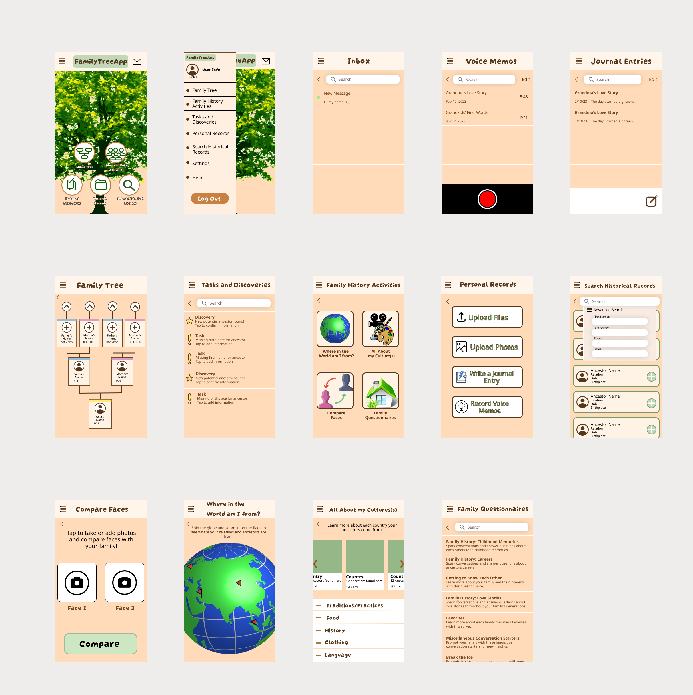
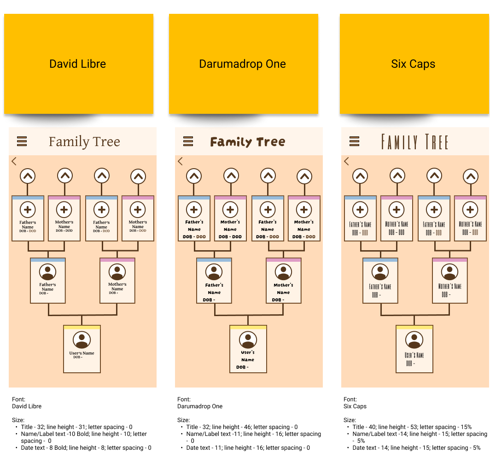
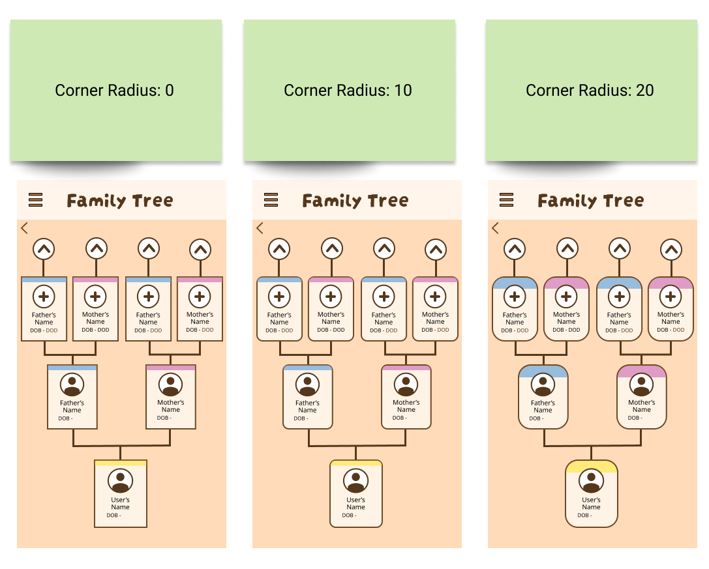
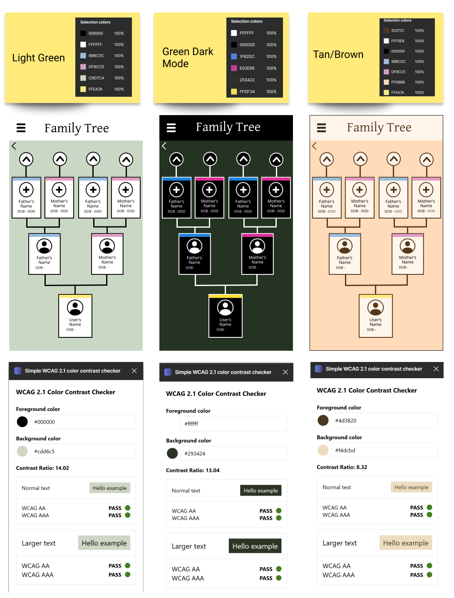
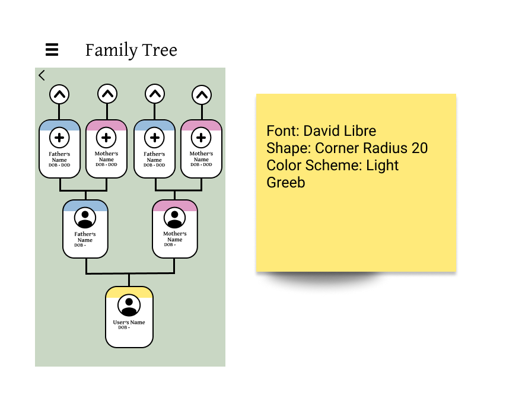

## Assignment 6 : Interface Design System

### Project Description:

 The primary objective of this project is to enhance the overall user experience of genealogy technologies, with a specific emphasis on fostering family connections for each individual user. To achieve this goal, our focus lies in the development of a genealogy app that optimizes the user journey, ensuring a seamless and intuitive experience. 

In order to determine the most effective interface for our target users, we employ an interface design system that delves into various app appearances and their potential impact. This systematic approach allows us to thoroughly examine the influence of different elements such as shapes, layouts, colors, and typography on the user's impression and usability of the app.

By exploring a range of design options on a digitized wireframe of the app's family tree feature, we aim to identify the visual and functional elements that resonate best with our users and align with their needs. This comprehensive evaluation of diverse interface possibilities enables us to refine and fine-tune the app's appearance, maximizing its usability and ultimately enhancing the users' ability to connect with their family history and heritage.
 
The digitized wireframe can be found [here](https://www.figma.com/file/foHAtFw2yVjXmyHeFCiJ6X/Week-5?type=design&node-id=5-2).

### Graphical User Interface Design Variations

#### Layout

For the layout, I followed a 6 row and 4 column layout for the phone screen format. It also has a row margin of 20px and a gutter of 40px.

#### Typography

For the typography of the wireframe, I explored three distinct fonts and various font sizes that best fit with each section of the family tree interface. The first was David Libre, a more standard and familiar font. I then looked at Darumadrop One, which appeared more playful and fun but considerably childish. Lastly I explored Six Caps which was a more sharp and professional font but presented some readability issues even after altering the letter spacing.

#### Shapes

To explore shape variation, I looked into three different corner radii for the family member profile rectangles/ buttons. The first was no radius and maintained the pointed rectangular shape. Then the following two explore radii of 10 and 20 px. The first variation presents a very traditional and professional feel but also a more rigid and sharp appearance. Then as the roundness increased we start to have a more welcoming shape to the eye but perhaps sacrifice some of that seriousness.

#### Colors

Looking into color schemes, we start out with a light green motif and color coding for the maternal, paternal, and self family profiles. The second scheme presents a dark mode alternative to the light green scheme. And lastly, I played around with a scheme of different shades of brown and tan for a more neutral earth tone interface.

### Accessibility
In order to evaluate the accessibility of my assorted color scheme selections, I employed a WCAG 2.1 color contrast checker. As seen in the image above, each of the color schemes passed this test when comparing the foreground colors to the text colors, with the light green color scheme having the greatest contrast ratio at 14.02.

### Decision Making Process

For the final design selection, I first went with David Libre for the typography. This font format also had varying font sizes for the title, family member subtitle, and dates subtitles. I decided on this style because it presented the best balanced of welcoming, professional, and readable for all users. Next I decided on the 20 px corner radius for the shape of my family tree profile buttons. I found that the more round I made this shape, the more inviting and user-friendly it appeared. Lastly, I chose the light green color scheme as it had the most natural contrast to the eyes as seen in the contrast test and also contained the most friendly or welcoming colors. 

### Impression Test

To gather feedback from users on my design selection, I performed a 5 second impression test of the final design as well as showed my user the interface design system choices for additional information.

I asked the user to take five seconds to really look at the design and then asked them to tell me what they remember from the image and what they felt about it

The following are a few quotes from the test:

* "The green color choice is very likeable and homey. It also kind of reminds me of older people which is what I’m looking into with this app".
* "The roundness of the family tree shapes appears very user friendly. It's not too rigid making it seem more welcoming".
* "The font is professional for a credible app but also user friendly and not too stiff".

Summary: Overall, the user reported feeling very invited to play around with this section of the wireframe. They mentioned how user-friendly it all felt while still maintaing a good balance of professional and welcoming aspects as well. When showing them the other design options I had after conducting the impression test, they pointed out how the darumadrop font was too childish but the addition of the rounder shapes made it more family friendly without sacrificing professionalism. In fact, they even mentioned how the standard rectangles made the tree feel almost uncomfortable and much too rigid.

The Interface Design System can be found [here](https://www.figma.com/file/foHAtFw2yVjXmyHeFCiJ6X/Week-5?type=design&node-id=0-1).
