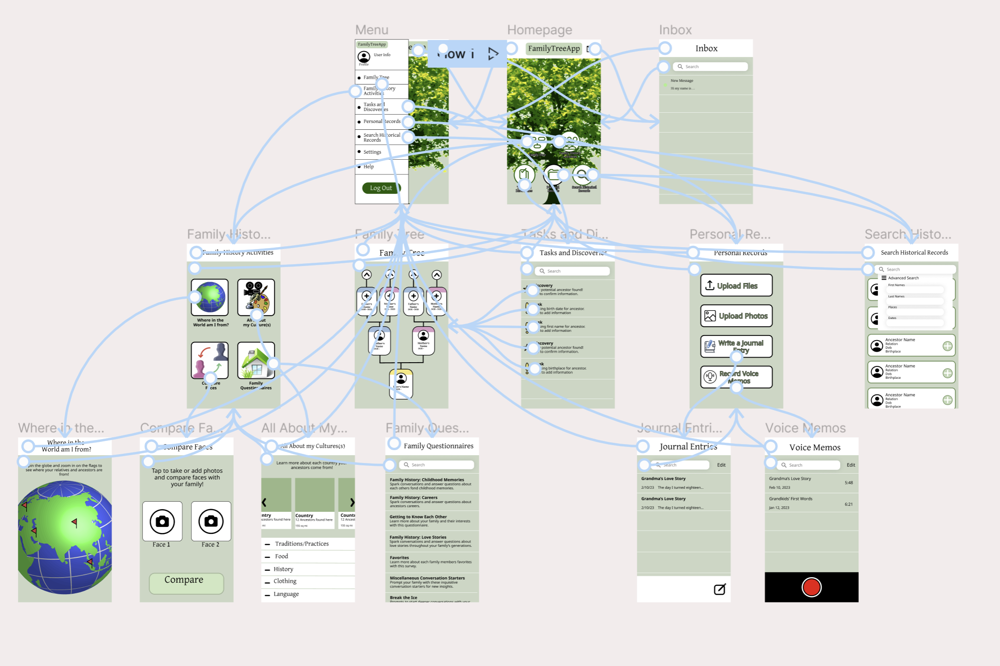
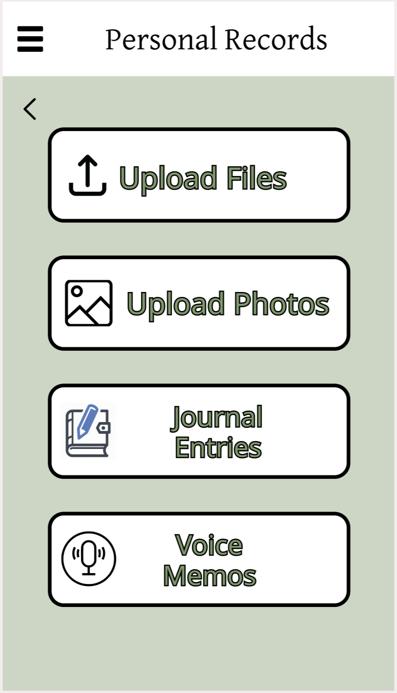
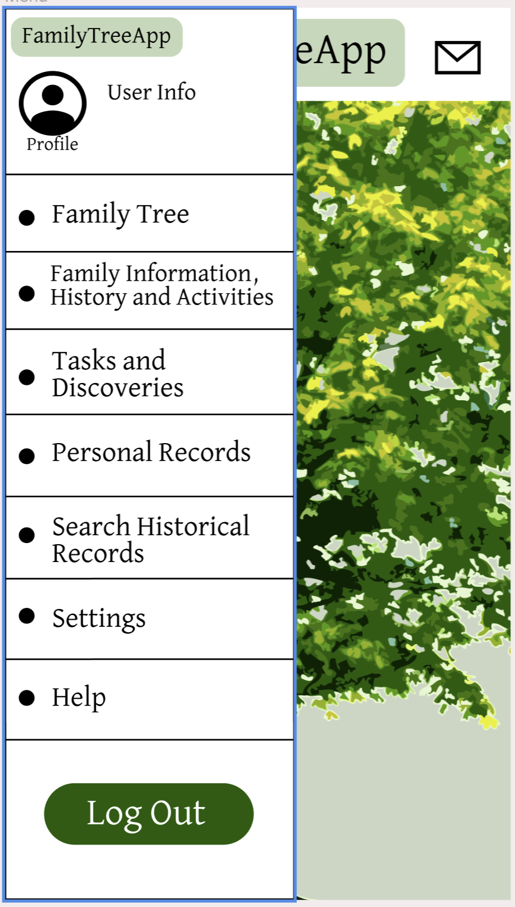

## Assignment 7 : High Fidelity Prototype

### Project Description:

 The main aim of this project is to improve the user experience of genealogy technologies, placing particular emphasis on strengthening family connections for each user. To accomplish this objective, our primary focus is on creating a genealogy app that enhances the user journey, ensuring a smooth and intuitive experience. In order to showcase the functionality and flow of the app, I have developed a high fidelity interactive prototype for this assignment. The prototype was crafted using Figma, a browser-based UI and UX application that enables prototyping and code generation.
 
 The purpose of creating a high fidelity prototype for an app is to provide a realistic and interactive representation of the final product before the development phase. It allows designers, stakeholders, and users to experience the app's look, feel, and functionality in a more tangible way. The high fidelity prototype helps validate design choices, gather feedback, and uncover usability issues early in the design process, resulting in a more refined and user-centered final product.

The process of creating a high fidelity prototype in Figma involves several key steps. Firstly, the designer imports design assets, such as icons, images, and UI components, into Figma. Using Figma's powerful design tools, they then lay out the app's screens, ensuring consistency in visual elements, typography, and spacing. Interactions and animations are added to simulate the app's behavior, creating a more engaging and realistic user experience. Interactive elements like buttons, menus, and forms are linked to different screens or actions, allowing users to navigate and interact with the prototype as they would with the actual app. Finally, the designer can share the high fidelity prototype with stakeholders and users for feedback, conducting user testing and gathering insights to refine and improve the design before moving to the development phase.

### Task List

 The high-fidelity prototype for my genealogy app supports a number of tasks.
1. A search section for family records
2. Four activities you can complete with your family to learn more about your history:
       a. A world map that flags locations your family may be from
       b. A section to learn more about your cultures
       c. A page to compare faces with family members
       d. A list of questionairres to complete with your family
4. A section that generates discoveries that may align with your family tree information and tasks in order to fix any potential information error in your tree
5. A family tree page to map your ancestors
6. A page of personal records where you can keep files, photos, voice memos, and journal entries.

### Wireflow / Graphic Design

### Interactive Protoype

The interactive prototype can be found in figma [here](https://www.figma.com/proto/foHAtFw2yVjXmyHeFCiJ6X/Week-5?type=design&node-id=38-2766&scaling=min-zoom&page-id=5%3A2&starting-point-node-id=38%3A2766).

### Cognitive Walkthrough

The purpose of a cognitive walkthrough for a high fidelity prototype of an app is to evaluate and assess the user experience and usability of the application. It involves systematically going through the app's interface and features to identify any potential usability issues, understand how users would interact with the app, and evaluate the effectiveness of the design in achieving its intended goals. During a cognitive walkthrough, evaluators simulate the perspective of the app's user and step through various tasks or scenarios. They assess the app's user interface elements, such as buttons, menus, and navigation, to determine if they are intuitive and easy to understand. The walkthrough also examines the flow of interactions, ensuring that users can achieve their goals efficiently and without confusion.

For this particular walkthrough, the user was prompted with the following tasks:

1. Locate a voice memo about your grandma
2. Use the menu section to learn more about your culture
3. Add a discovery to your family tree
4. Choose a family activity to complete with your family

The user was able to easily identify sections such as the menu and all main task areas, but had difficulty identifying the exact purpose subsections of each task area by the task area titles. For example, when looking for their grandmothers voice memo, they confused the "record voice memo option" with only being able to record new voice memos instead of it containing family memos already. Additionally, they did not initially connect that the "All about my culture" option would reside under "family history activites".

The link to the cognitive walkthrough transcript can be found [here](https://docs.google.com/document/d/1LCEyd4SrT9X5VaBt3GqE_DQXAtfWY6Ua3jzzuYqzzww/edit?usp=sharing).

### Feedback Alterations

After conducting the cognitive walkthrough I went back and chose more clear titles for some of the features for the app. For example, I renamed "Record Voice Memos" to just "Voice Memos" so people can have a more clear understanding that it is a place to both listen and record voice memos. I also renamed "Family History Activities" to "Family History, Information and Activities" in order to be more inclusive in the various offered tasks in this section that may not be considered just activities to all.

 
